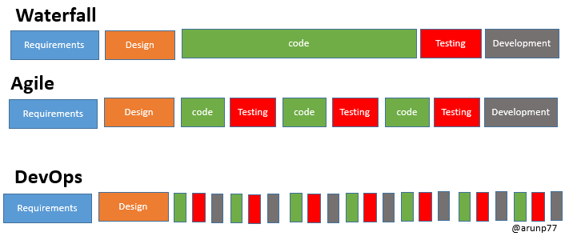

# Software Development Methodologies in System Engineering

## Overview

In system engineering, selecting the right development methodology is important for successful project delivery, operational efficiency, and long-term maintainability. Different methodologies offer different strengths depending on project complexity, stakeholder involvement, timelines, and change requirements.

This document provides an overview of three widely used methodologies:

- Waterfall
- Agile
- DevOps

---

# 1. Waterfall Methodology

## Definition

The Waterfall model is a traditional and linear software development approach. It follows a sequential process where each phase must be completed before moving to the next stage.

## Purpose

### Phased Development

The project is divided into clear stages:

1. Requirements Gathering
2. Design
3. Implementation
4. Testing
5. Deployment
6. Maintenance

### Predictability

Because each phase is planned in advance, Waterfall offers a structured and predictable framework for managing projects.

### Minimal Client Involvement

Client interaction usually happens:

- At the beginning (requirements phase)
- At the end (delivery phase)

## Challenges

### Rigidity

Once a phase is completed, making changes can be difficult and expensive.

### Delayed Feedback

Problems often appear late during testing, which may delay corrections.

---

# 2. Agile Methodology

## Definition

Agile is an iterative and incremental approach to software development that focuses on flexibility, speed, and continuous improvement.

## Purpose

### Iterative Development

Software is delivered in smaller functional parts through short cycles called iterations or sprints.

### Adaptability

Agile supports changing requirements, even during later stages of development.

### Customer Collaboration

Frequent communication with clients and stakeholders is a core principle.

## Challenges

### Resource Intensive

Continuous meetings, planning, and collaboration may require more team involvement.

### Limited Documentation

Less formal documentation can create difficulties in large or highly regulated projects.

---

# 3. DevOps Methodology

## Definition

DevOps is a culture and engineering practice that combines software development and IT operations to improve delivery speed, reliability, and automation.

## Purpose

### Collaboration

Encourages close coordination between:

- Development teams
- Operations teams
- QA teams
- Security teams
- Business stakeholders

### Automation

Uses CI/CD pipelines to automate:

- Build processes
- Testing
- Deployment
- Infrastructure provisioning

### Continuous Monitoring

Applications and infrastructure are continuously monitored for faster issue detection and recovery.

## Challenges

### Cultural Shift

Requires breaking silos between traditionally separate teams.

### Learning Curve

New tools, cloud platforms, and automation frameworks may require training.

---

# Comparison Table

| Criteria             | Waterfall                                | Agile                          | DevOps                                     |
| -------------------- | ---------------------------------------- | ------------------------------ | ------------------------------------------ |
| Adaptability         | Resistant to changes after project start | Embraces changing requirements | Handles changes through automation         |
| Customer Involvement | Limited involvement                      | Continuous collaboration       | Cross-functional stakeholder collaboration |
| Release Frequency    | End of project                           | Frequent incremental releases  | Continuous delivery                        |
| Documentation        | High                                     | Moderate / Low                 | Moderate                                   |
| Speed                | Slower                                   | Faster                         | Fastest with automation                    |
| Best For             | Fixed-scope projects                     | Dynamic projects               | Scalable cloud operations                  |

---

# Relevance to System Engineering

In system engineering environments, methodology selection depends on infrastructure maturity, compliance needs, operational complexity, and delivery goals.

### Waterfall is suitable for:

- Satellite systems
- Government contracts
- Hardware-integrated systems
- Highly regulated environments

### Agile is suitable for:

- Application development
- Analytics platforms
- Internal tools
- Data products

### DevOps is suitable for:

- Cloud infrastructure
- CI/CD pipelines
- Monitoring systems
- Automated deployments
- Scalable production systems

---

# Practical Approach

Modern organizations often use hybrid models:

- Waterfall for long-term planning
- Agile for development execution
- DevOps for deployment and operations

This combination provides both structure and flexibility.

---

# Conclusion

Each methodology serves a different purpose:

- **Waterfall** offers planning and predictability
- **Agile** provides flexibility and faster feedback
- **DevOps** improves collaboration, automation, and continuous delivery

For system engineering work, the best approach often combines elements of all three depending on project needs, technical constraints, and operational goals.
