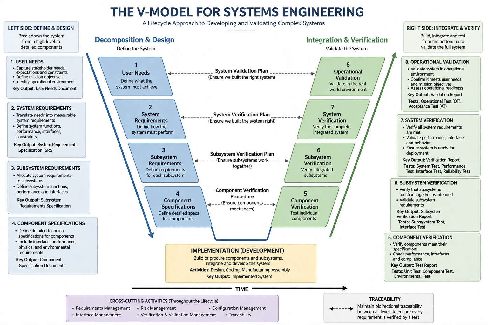
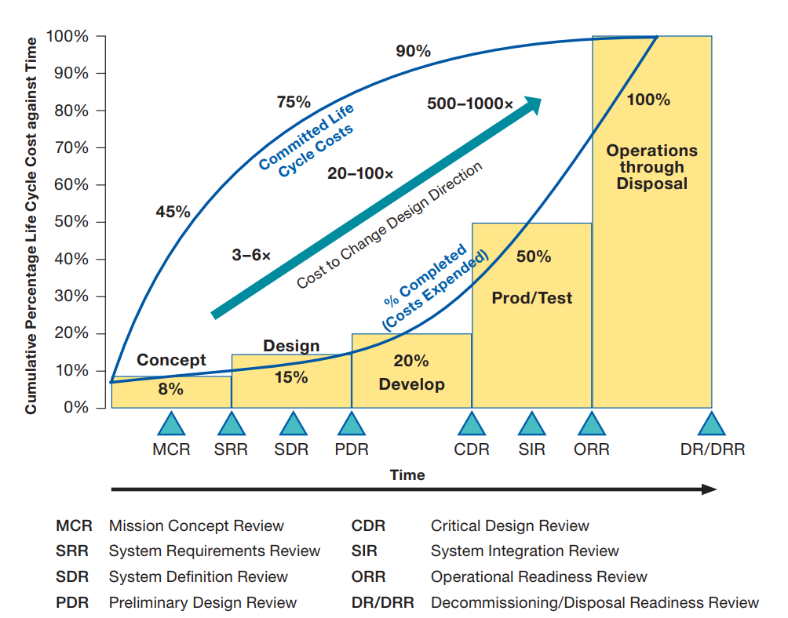
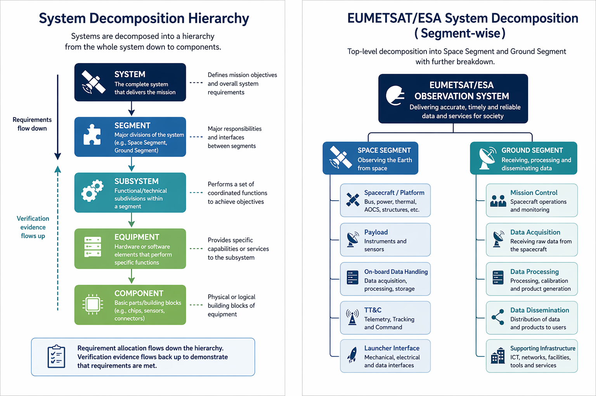

## Foundations of Systems Engineering

### Overview

The first phase establishes the theoretical and methodological foundation for all subsequent learning. It covers the core SE process, lifecycle models, standards, and the single most critical practical skill in EUMETSAT SE roles: requirements engineering.

### Core Systems Engineering Concepts

**The V-Model**

The V-model is the foundational process model for systems engineering. The left side of the V represents decomposition — from user needs through system requirements, subsystem requirements, and component specifications. The right side represents integration and verification — component testing, subsystem integration, system verification, and operational validation. The two sides are connected at each level, meaning every design decision on the left must be verified by a corresponding test on the right.





**Refrence:** [https://www.nasa.gov/wp-content/uploads/2018/09/nasa_systems_engineering_handbook_0.pdf](https://www.nasa.gov/wp-content/uploads/2018/09/nasa_systems_engineering_handbook_0.pdf)

Understanding the V-model is essential for EUMETSAT work because all ground segment developments follow this structure. Review gates (SRR, PDR, CDR, QR, AR) occur at specific points in the V, and systems engineers are responsible for ensuring that the system is mature enough to pass each gate.

**System Lifecycle**

The system lifecycle encompasses all phases from initial concept to decommissioning. For EUMETSAT satellite programmes, this typically includes:

- Phase 0: Mission Analysis and Needs Identification
- Phase A: Feasibility
- Phase B: Preliminary Design
- Phase C: Detailed Design
- Phase D: Qualification and Production
- Phase E: Launch, Commissioning, and Operations
- Phase F: Disposal

These phases follow the ECSS (European Cooperation for Space Standardization) standard ECSS-M-ST-10 on Project Planning and Implementation, which EUMETSAT adheres to as a European space agency.

**System Decomposition and Hierarchy**

Systems are decomposed into a hierarchy:

```
System    →    Segment    →    Subsystem    →    Equipment    →    Component.
```

At EUMETSAT, the top-level decomposition is typically Space Segment and Ground Segment, with further decomposition into mission control, data acquisition, data processing, dissemination, and supporting infrastructure. Understanding how requirements flow down this hierarchy (requirement allocation) and how verification evidence flows back up (traceability) is a core SE skill.



### Key Standards to Study

**ECSS Standards**

EUMETSAT follows ECSS standards, developed under the auspices of ESA, EUMETSAT, and national space agencies. The most important for systems engineering are:

- **ECSS-E-ST-10**: Space Engineering — System Engineering General Requirements. This is the primary reference for SE processes at EUMETSAT.
- **ECSS-E-ST-10-06**: Technical Requirements Specification. Covers how to write and manage requirements.
- **[ECSS-E-ST-10-02](https://ecss.nl/wp-content/uploads/standards/ecss-e/ECSS-E-10-02A17Nov1998.pdf)**: Verification. Covers the V&V process.
- **ECSS-M-ST-10**: Project Planning and Implementation. Covers lifecycle management.
- **ECSS-Q-ST-80**: Software Product Assurance.

All ECSS standards are freely downloadable from [ecss.nl](https://ecss.nl/). Reading the above documents is not optional — they are the actual standards against which EUMETSAT programmes are audited.

**NASA Systems Engineering Handbook (SP-2016-6105)**

The [NASA SE Handbook](https://www.nasa.gov/wp-content/uploads/2018/09/nasa_systems_engineering_handbook_0.pdf) is an excellent, freely available complement to ECSS. It is more readable and contains worked examples, detailed guidance on requirements writing, interface management, and technical reviews. It is strongly recommended as a companion to ECSS reading.

**INCOSE Systems Engineering Handbook**

The INCOSE handbook (latest edition) provides the international consensus view of SE best practices. It covers the full SE process, introduces key concepts like functional analysis, trade studies, and interface management, and maps to the ISO/IEC 15288 standard (System Lifecycle Processes), which ECSS is aligned with.

### Requirements Engineering

Requirements engineering is the single skill most consistently demanded across all EUMETSAT systems engineering job postings. It encompasses eliciting, documenting, managing, and verifying requirements throughout the system lifecycle.

**Writing Good Requirements**

A well-written requirement must be: verifiable, unambiguous, complete, consistent, traceable, and feasible. Requirements are written as "shall" statements. Poor requirements are one of the most common causes of project failures in the space industry.

Examples of poor vs. good requirements:

- Poor: "The system should be fast."
- Good: "The ground processing system shall generate Level 1b products within 30 minutes of data acquisition under nominal operating conditions."

**Requirements Management and Traceability**

Every requirement must be traceable — both to its parent requirement (upward traceability, showing it derives from a higher-level need) and to its verification evidence (downward traceability, showing it has been tested). A requirements traceability matrix (RTM) documents these relationships.

**IBM DOORS and DOORS Next**

IBM DOORS (Dynamic Object-Oriented Requirements System) is the industry-standard tool for requirements management in the space industry and is explicitly referenced in EUMETSAT job descriptions. Learning DOORS is non-negotiable for a serious SE career at EUMETSAT.

Practical steps:

- Download the IBM DOORS trial or use DOORS Next Generation (DNG), the modern web-based version
- Practice creating modules, writing requirements, creating attributes, establishing links between requirements, and generating traceability reports
- Study the concept of baselines — freezing a set of requirements at a programme milestone

### Study Resources for Phase 1

- ECSS Standards ([ecss.nl](https://ecss.nl/) free download)
- [NASA SE Handbook](https://www.nasa.gov/wp-content/uploads/2018/09/nasa_systems_engineering_handbook_0.pdf)
- INCOSE SE Handbook (purchasable via incose.org)
- IBM DOORS tutorials on [YouTube](https://www.youtube.com/watch?v=bIk33ca0oWQ) and [IBM documentation portal](https://www.ibm.com/docs/en/engineering-lifecycle-management-suite/doors/9.7.2?topic=tutorials)
- Kossiakoff & Sweet, "Systems Engineering: Principles and Practice" (textbook)

### Important links

- [Software development: Introduction to IV&V](https://arunp77.github.io/iv-and-v.html)
- [CI/CD: Streamlining Software Development](https://arunp77.github.io/ci-cd-Jenkins.html#waterfall)
