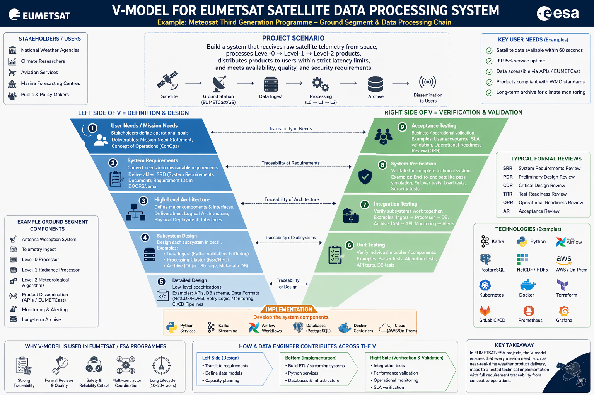

## Verification and Validation

### Overview

Verification and Validation (V&V) is the systematic process of ensuring that a system meets its specified requirements (verification) and that it meets the actual needs of users and stakeholders (validation). It is one of the most technically demanding aspects of systems engineering and occupies a large portion of any space programme's development effort.

### Verification vs. Validation

The distinction is subtle but important:

- **Verification** answers: "Are we building the system right?" It checks compliance against the specification. Methods include testing, analysis, inspection, and demonstration. Each requirement must have a defined verification method.
- **Validation** answers: "Are we building the right system?" It checks that the system, when operated in its intended environment, satisfies the stakeholder's actual needs — even needs that may not have been perfectly captured in the requirements specification.

At EUMETSAT, an example of the distinction: verification of the Level 1b processor confirms that it applies the specified radiometric calibration algorithm correctly (verification against the ICD). Validation confirms that the resulting radiance products are of sufficient accuracy for numerical weather prediction users (validation against user needs).

### Verification Methods

The four recognised verification methods under ECSS-E-ST-10-02 are:

- **Test**: The system or component is exercised and its outputs are measured against expected values. The most rigorous method.
- **Analysis**: Mathematical or logical analysis demonstrates compliance. Used when testing is impractical (e.g., orbital lifetime analysis).
- **Inspection**: Physical examination confirms a characteristic (e.g., inspecting cable routing).
- **Demonstration**: Operational use of the system demonstrates a functional capability without detailed measurement.

Each requirement in the requirements database should be assigned one of these methods, documented in the Verification Control Document (VCD).

### The V&V Process

- **Verification Planning**: At the start of a programme, the Verification Plan (VP) is written, defining the overall strategy, the verification levels (component, subsystem, system), the test environments, and the schedule.
- **Test Specification**: For each verification activity, a Test Specification document defines the exact test conditions, input data, procedures, pass/fail criteria, and expected results.
- **Test Execution and Reporting**: Tests are executed in controlled environments. Results are documented in Test Reports. Non-conformances (failures to meet requirements) are documented in Non-Conformance Reports (NCRs) or Problem Reports (PRs) and must be formally resolved before programme milestones.
- **Verification Closure**: At the end of the programme, the Verification Status Matrix (VSM) documents the status of every requirement — verified, partially verified, or open. Open items must be formally accepted by the customer (EUMETSAT) with agreed corrective action plans.

### Review Gates

EUMETSAT programmes follow the ECSS review gate structure. Systems engineers prepare for and participate in all reviews:

- **System Requirements Review (SRR)**: Confirms that the system requirements baseline is complete and consistent. The SE must demonstrate requirements quality, completeness, and traceability.
- **Preliminary Design Review (PDR)**: Confirms that the preliminary design satisfies all requirements and that development risks are understood. MBSE models and architecture documents are presented.
- **Critical Design Review (CDR)**: Confirms that the detailed design is complete and ready for implementation/production. Interface control documents must be finalised.
- **Qualification Review (QR)**: Confirms that the qualification testing campaign has demonstrated compliance with all requirements.
- **Acceptance Review (AR)**: Final acceptance by the customer (EUMETSAT) of the delivered system. The Verification Status Matrix must show closure of all requirements.

### Automated V&V and Python

Your Python skills are directly applicable to V&V automation:

- Automated test execution scripts for ground processing software
- Automated comparison of test results against expected values from requirements databases
- Statistical analysis of test results across multiple test runs (pass rates, regression analysis)
- Automated generation of verification status reports from DOORS exports
- Performance benchmarking and regression testing of data processing pipelines

## Sample example

**Project Scenario:**

Build a system that:

- Receives raw satellite telemetry from space
- Processes Level-0 → Level-1 → Level-2 products
- Distributes products to users within strict latency limits
- Meets availability, quality, and security requirements

